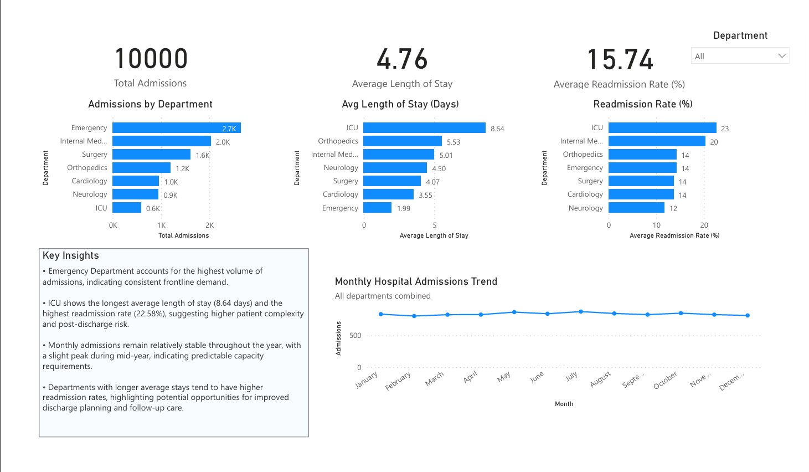
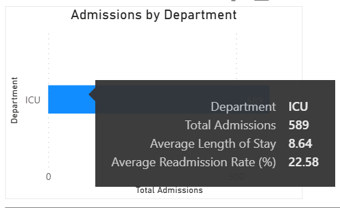

# Hospital Patient Flow & Operations Analytics

## Overview
This project analyzes hospital patient flow and operational performance using synthetically generated healthcare data.  
It demonstrates an end-to-end analytics workflow combining **Python, SQL, and Power BI** to generate actionable operational insights at both hospital and department levels.

All data used in this project is synthetic and does not represent real patients.

---

## Project Objectives
- Analyze hospital admissions and patient flow
- Measure operational efficiency using key KPIs
- Compare department-level performance
- Identify capacity and readmission risk patterns
- Demonstrate a complete analytics pipeline from raw data to dashboard

---

## Tools & Technologies
- **Python** (pandas, matplotlib)
- **SQL** (SQLite)
- **Jupyter Notebook**
- **DBeaver**
- **Power BI Desktop**

---

## Dataset
Synthetic hospital patient data designed to reflect realistic healthcare operations, including:
- Patient demographics (age, gender, nationality)
- Insurance type (national / private)
- Admission type (planned vs emergency)
- Hospital department and diagnosis
- Admission and discharge dates
- Length of stay (LOS)
- 30-day readmission indicator

---

## Key KPIs
- Total admissions
- Admissions by department
- Average length of stay (LOS)
- Monthly admissions trend
- Department-level readmission rates

---

## Project Structure
hospital-patient-analytics/
│
├── data/
│ ├── hospital.db
│ ├── hospital_patients_raw.csv
│ ├── hospital_patients_dirty.csv
│ ├── hospital_patients_clean.csv
│
├── sql/
│ ├── 01_schema.sql
│ ├── 02_kpis.sql
│ ├── 03_trends.sql
│ └── 04_readmissions.sql
│
├── outputs/
│ ├── kpis_summary.csv
│ ├── department_performance.csv
│ ├── monthly_admissions.csv
│ └── readmissions_by_department.csv
│
├── images/
│ ├── dashboard_overview.jpg
│ ├── icu_department_insight.png
│ ├── admissions_by_department.png
│ ├── avg_los_by_department.png
│ └── monthly_admissions_trend.png
│
├── powerbi/
│ └── Hospital_Admissions_Dashboard.pbix
│
├── hospital_analysis.ipynb
└── README.md

---

## Analysis Workflow
1. Generate and clean synthetic hospital patient data using Python
2. Store cleaned data in a SQLite database
3. Define schema and perform analytical queries using SQL
4. Export aggregated KPI tables for reporting
5. Build an interactive Power BI dashboard
6. Analyze department-level performance and trends

---

## Power BI Dashboard

### Dashboard Overview

  

The dashboard provides a high-level view of hospital operations, including:
- Total admissions
- Average length of stay
- Average readmission rate
- Department-level comparisons
- Monthly admissions trend

---

### Department-Level Insight (Example: ICU)

  

Hover-based tooltip analysis highlights:
- ICU has the **longest average length of stay (8.64 days)**
- ICU also shows the **highest readmission rate (22.58%)**
- Indicates higher patient complexity and post-discharge risk

---

## Key Insights
- Emergency departments handle the highest patient volumes, reflecting frontline demand
- ICU patients have longer stays and higher readmission risk
- Admissions remain relatively stable throughout the year
- Departments with longer LOS tend to show higher readmission rates
- Operational data can support capacity planning and discharge optimization

---

## Notes
- This project focuses on **analytics methodology**, not predictive modeling
- Power BI file is included for full interactivity
- All data is synthetic and safe for public sharing

---

## Contact
LinkedIn: https://www.linkedin.com/in/kon-kras/
