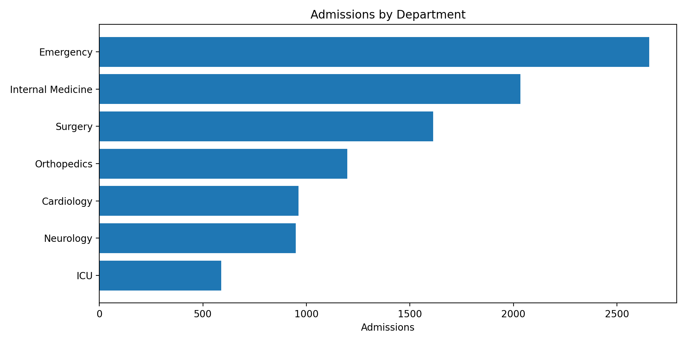
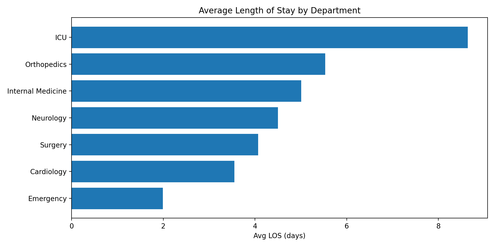
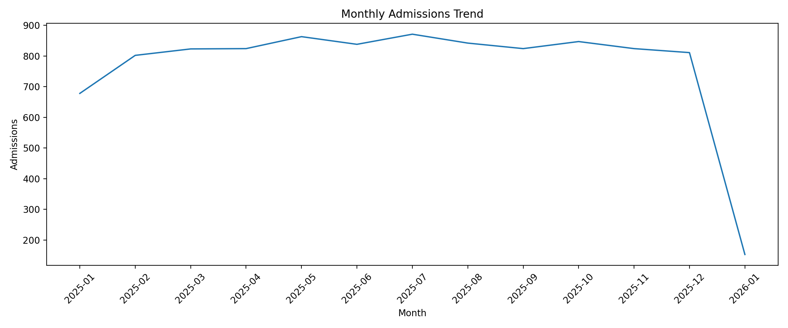
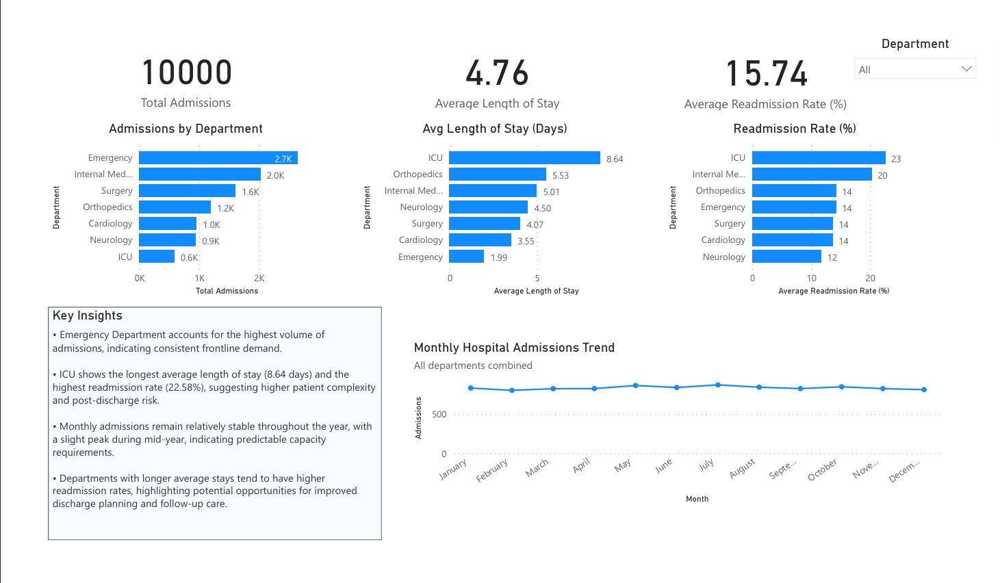

# Hospital Patient Flow & Operational Performance Analytics  
End-to-End Healthcare Operations Intelligence Framework

---

## Executive Overview

This project models hospital patient flow and operational performance using **synthetic healthcare data** to replicate real-world operational analytics environments.

It demonstrates a structured pipeline combining:

- Python (data engineering & preprocessing)
- SQL (KPI layer & aggregation logic)
- Power BI (executive dashboard layer)

The objective is not predictive modeling —  
but operational visibility, KPI architecture, and department-level performance monitoring.

All data is synthetic and safe for public use.

---

## Business Context

Hospital operations require continuous monitoring of:

- Admission volume and distribution
- Length of stay (LOS)
- Readmission risk
- Department capacity pressure
- Monthly demand stability

This framework translates raw patient-level records into executive-ready operational intelligence.

---

# Key Operational KPIs

- Total Admissions
- Admissions by Department
- Average Length of Stay (LOS)
- Monthly Admissions Trend
- 30-Day Readmission Rate
- Department-Level Performance Comparison

---

# Core Analytical Outputs

## 1️⃣ Admissions by Department



Emergency accounts for the highest volume, reflecting consistent frontline demand.  
ICU shows lower volume but higher resource intensity.

---

## 2️⃣ Average Length of Stay (LOS)



ICU demonstrates the longest LOS (8.64 days), indicating higher case complexity.  
Emergency shows the shortest LOS, consistent with triage-driven flow.

---

## 3️⃣ Monthly Admissions Trend



Admissions remain relatively stable throughout the year, with moderate mid-year peaks.  
This supports predictable capacity planning assumptions.

---

## 4️⃣ Executive Dashboard Layer (Power BI)



The dashboard consolidates:

- 10,000 total admissions
- 4.76 average LOS
- 15.74% average readmission rate
- Department comparisons
- Interactive filtering

Designed for executive-level operational monitoring.

---

## 5️⃣ Department-Level Insight (ICU Example)


ICU shows:

- Highest average LOS (8.64 days)
- Highest readmission rate (22.58%)

This combination suggests elevated patient complexity and post-discharge risk,  
highlighting opportunities for discharge planning optimization.

---

# Analytical Architecture

Synthetic Raw Data  
↓  
Python (Cleaning & Feature Engineering)  
↓  
SQLite Database  
↓  
SQL KPI Layer  
↓  
Aggregated CSV Outputs  
↓  
Power BI Dashboard  

Separation of layers ensures transparency, auditability, and reproducibility.

---

# Project Structure

```
hospital-patient-analytics/
│
├── data/
│   ├── hospital.db
│   ├── hospital_patients_raw.csv
│   ├── hospital_patients_dirty.csv
│   └── hospital_patients_clean.csv
│
├── sql/
│   ├── 01_schema.sql
│   ├── 02_kpis.sql
│   ├── 03_trends.sql
│   └── 04_readmissions.sql
│
├── outputs/
│   ├── kpis_summary.csv
│   ├── department_performance.csv
│   ├── monthly_admissions.csv
│   └── readmissions_by_department.csv
│
├── images/
│   ├── dashboard_overview.jpg
│   ├── icu_department_insight.png
│   ├── admissions_by_department.png
│   ├── avg_los_by_department.png
│   └── monthly_admissions_trend.png
│
├── powerbi/
│   └── Hospital_Admissions_Dashboard.pbix
│
├── hospital_analysis.ipynb
└── README.md
```

---

# Strategic Observations

- Emergency drives volume; ICU drives complexity.
- Longer LOS correlates with higher readmission rates.
- Monthly demand remains stable — suitable for structured capacity modeling.
- Department-level KPI segmentation enables targeted operational intervention.

---

# Technical Stack

- Python (pandas, matplotlib)
- SQLite
- SQL
- Power BI
- Jupyter Notebook

---

# Positioning Value

This project demonstrates:

- Operational KPI architecture
- Healthcare domain analytics
- Structured SQL business layer design
- BI dashboard integration
- End-to-end analytics pipeline ownership

It reflects practical healthcare operations intelligence — not isolated visualizations.

---

## Author

Konstantinos Krasnostan  
Data Analyst | Operational Intelligence & Business Analytics  

LinkedIn: https://www.linkedin.com/in/kon-kras/
